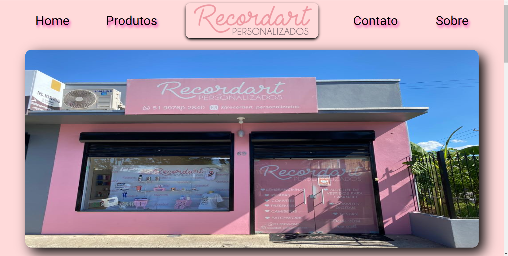

# RECORDART PERSONALIZADOS

> Site com o catálogo da loja Recordart Personalizados.

### Ajustes e melhorias

O projeto ainda está em desenvolvimento e as próximas atualizações serão voltadas nas seguintes tarefas:

- [x] Criar a página inicial
- [x] Tornar responsivo
- [x] Criar estilos próprios
- [ ] Implementar a página de produtos
- [ ] Tornar responsiva a página de produtos
- [ ] Publicar e entregar

## 🤝 Projeto realizado por mim:

<table>
  <tr>
    <td align="center">
      <a href="#">
         
        
          <b>Elinton Henrique Ev</b>
        
      </a>
    </td>
  </tr>
</table>

[⬆ Voltar ao topo](#recordart-personalizados) 
